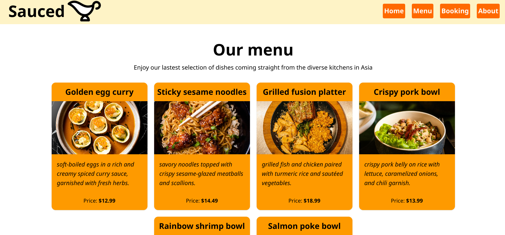

# 🧑‍🍳 Sauced

## Overview
A simple restaurant webpage designed to practice using ES6 modules for dynamic content rendering and mobile-first responsive design. This project showcases how to create a modular, responsive website with a focus on user interaction and seamless navigation.

Live demo: [https://julioapv.github.io/sauced/](https://julioapv.github.io/sauced/)

## 🚀 **Project Highlights**
- **Dynamic Content Rendering:** Utilizes ES6 modules to load and display content based on user interaction.
- **Mobile-First Design:** Built with a mobile-first approach to ensure responsiveness across all devices.
- **Modular Code Structure:** Organized into reusable components for maintainability and scalability.
- **Interactive UI:** Smooth navigation between different sections of the restaurant webpage.

## ✨ **Key Features**
1. **Dynamic Page Rendering:**
   - Loads different pages (Home, Menu, Booking, About) dynamically without reloading the page.
   - Uses event listeners to handle user interactions and update the DOM.

2. **Responsive Design:**
   - Optimized for mobile, tablet, and desktop screens.
   - Flexible layout using modern CSS techniques.

3. **User Interface:**
   - Clean and intuitive navigation menu.
   - Consistent styling across all pages.
   - Interactive buttons for seamless user experience.

4. **Component-Based Architecture:**
   - Each page (Home, Menu, Booking, About) is built as a separate module.
   - Easy to extend or modify individual components.

## 🎯 **Learning Objectives**
- Practice using ES6 modules for organizing and loading JavaScript code.
- Implement dynamic content rendering based on user interaction.
- Develop a responsive website using a mobile-first approach.
- Enhance skills in DOM manipulation and event handling.
- Learn to structure a project with reusable components.

## 🕹️ **How to Use It**
1. Visit the live demo link: [https://julioapv.github.io/sauced/](https://julioapv.github.io/sauced/).
2. Explore the different sections of the restaurant webpage:
   - **Home:** The main landing page.
   - **Menu:** Displays the restaurant's menu.
   - **Booking:** A section for making reservations.
   - **About:** Information about the restaurant.
3. Use the navigation buttons at the top to switch between sections.
4. The webpage is fully responsive, so try it on different devices or resize your browser window to see the layout adapt.

## 🛠️ **Technologies Used**
- **HTML5:** For structuring the webpage.
- **CSS3:** For styling and responsive design.
- **JavaScript (ES6):** For interactivity and dynamic content rendering.
- **Tailwind CSS:** For utility-first styling and rapid development.

---
Happy Exploring! 🍴